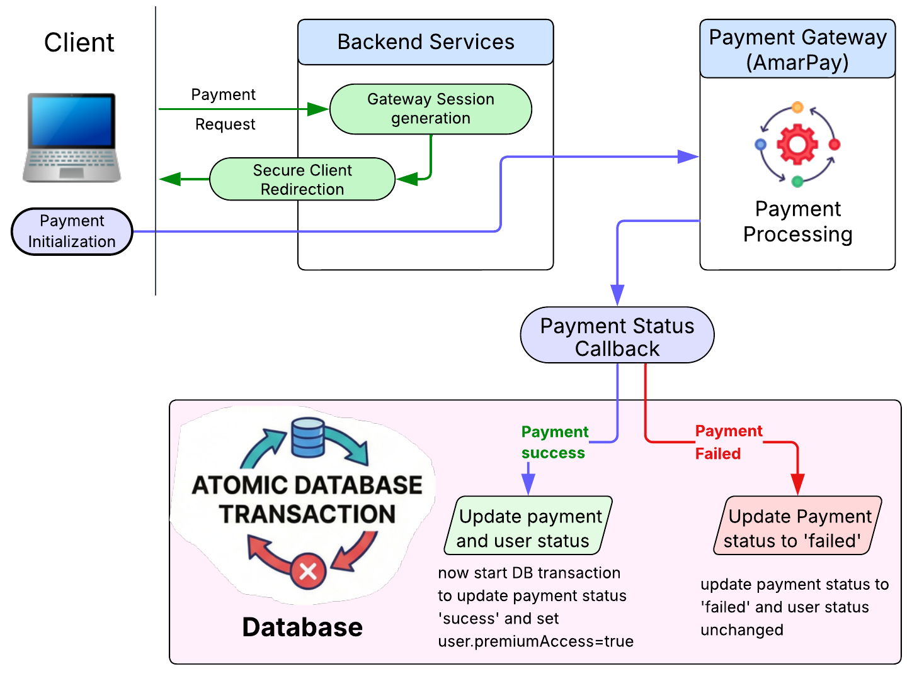
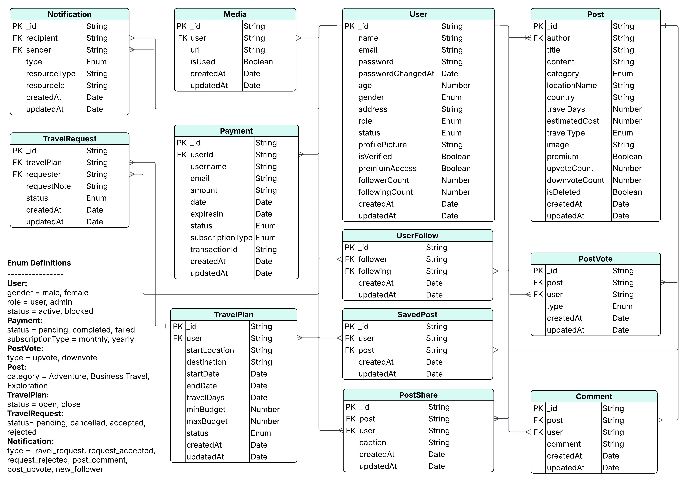

# TravelShare – Social Travel Planning Platform

A social travel platform where users share real travel experiences, discover destinations, and find travel partners.  
The system combines social media features with travel planning, partner matching, and budget-based trip discovery.

- [Click Live Website](https://travel-tips-and-destination-guides-client.vercel.app/)
- [Click Live Server API](https://travel-tips-and-destination-guides-backend.vercel.app)

## Key Features

- Social travel posts with images, votes, and comments
- Follow system with mutual connections
- Budget-based destination filtering
- Travel plan creation and partner matching
- Join request workflow (request → accept/reject)
- Saved trips for future planning
- Smart personalized feed
- Notification system (polling-based)
- Admin dashboard for moderation

## Tech Stack

- Node.js
- Express.js
- TypeScript
- MongoDB
- Mongoose
- Zod
- Cloudinary
- Nodemailer
- JWT Authentication (RBAC)
- RESTful API architecture
- Modular service-based structure

## System Architecture

### High-Level System Architecture (Payment):



> More architecture diagram will be added later

### ER Diagram:

`User` `Post` `PostVote` `UserFollow` `Comment` `TravelPlan` `TravelRequest` `Media` `Notification` `Payment` `SavedPost`



## API Documentation

All technical documentation is available in the `docs/` folder:

- [Data Model](./docs/data-model.md)
- [API Endpoints](./docs/api-endpoints.md)
- [Swagger API](./docs/swagger.yaml)
- [Developer Guideline](./docs/developer-guideline.md)

## Project Folder Structure

```
src/
├── app/
    ├── config/
    ├──DB/
    ├──errors/
    ├──interface/
    ├──middlewares/
    ├──modules/
    │   ├──auth/
    │   ├──comments/
    │   ├──insights/
    │   ├──media/
    │   ├──notifications/
    │   ├──payments/
    │   ├──post/
    │   ├──postVote/
    │   ├──savedPost/
    │   ├──travelPlan/
    │   ├──travelRequest/
    │   ├──uploadFile/
    │   ├──user/
    │   └──userFollow/
    ├──queryBuilder/
    ├──routes/
    ├──utils/
├── server.ts
├── app.ts
docs/
.env
tsconfig.json
package.json
vercel.json
.gitignore
README.md
```

## Installation Guide

### 1. Clone the repository

```bash
git clone https://github.com/yourusername/travelshare.git
cd travelshare
```

### 2. Install dependencies

```bash
npm install
```

### 3. Create `.env` file

Create a `.env` file in the root directory. Now copy the content of the `.env.example` file and page into `.env` file. Complete with your environement variable like below.

```
PORT=5000
DATABASE_URL=your_mongodb_connection_string
JWT_ACCESS_SECRET=your_access_secret
.... and so on
```

### 4. Run the server

```bash
npm run dev
```

Server will run at: `http://localhost:5000`

## Author

**Masud Rana**
Backend Engineer (Node.js)

- Portfolio: [https://masudranasheikh.me](https://masudranasheikh.me)
- GitHub: [https://github.com/mkmasudrana806](https://github.com/mkmasudrana806)
- LinkedIn: [https://linkedin.com/in/masud-rana-eng](https://linkedin.com/in/masud-rana-eng)
