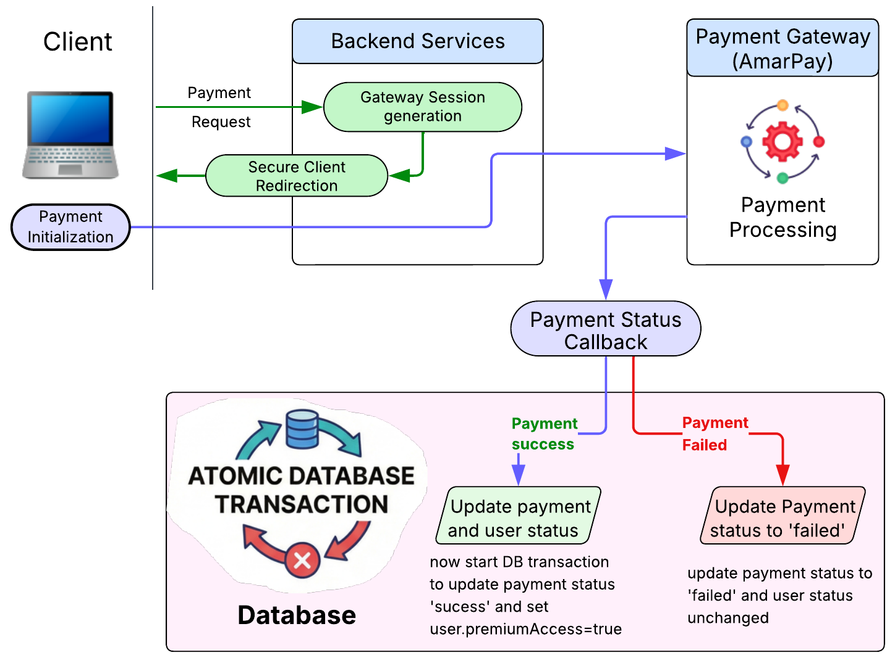
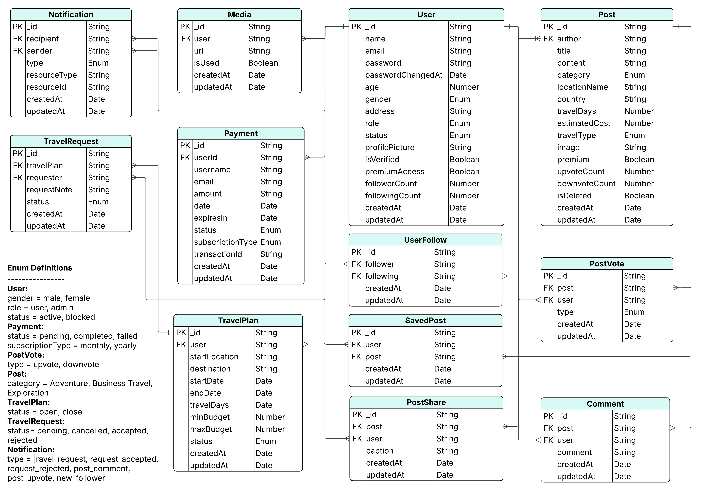

# TravelShare – Social Travel Planning Platform

It allows users to share travel experiences, follow other travelers, create travel plans, finding travel partners, interact through comments, and manage social engagement features such as votes, saved posts, and notifications.

The system is designed using a modular and layered architecture to ensure scalability, maintainability, and separation of concerns.

- [Click Live Website](https://travel-tips-and-destination-guides-client.vercel.app/)
- [Click Live Server API](https://travel-tips-and-destination-guides-backend.vercel.app)

## Core Features

- Social travel posts with images, votes, and comments
- Follow system with mutual connections
- Budget-based destination filtering
- Travel plan creation and partner matching
- Join request workflow (request → cancel/accept/reject)
- Saved trips for future planning
- Smart personalized feed
- Notification system (polling-based)
- Travel sharing of others experiences
- Admin dashboard for moderation
- Centralized error handling
- Security best practices

## Tech Stack

- Node.js
- Express.js
- TypeScript
- MongoDB
- Mongoose
- Zod (Input validation)
- Cloudinary (media upload)
- Nodemailer (email service)
- JWT Authentication (RBAC)
- RESTful API architecture

## System Architecture

<details>
    <summary> High-Level Payment's System Architecture (Click): </summary>
    


> More architecture diagram will be added later

</details>

**Fore more details:** [Architecture overview](./docs/architecture/architecture.md)

### ER Diagram:



**Fore more details:** [Database design](./docs/database-design.md)

## API Documentation

All technical documentation is available in the `docs/` folder:

- [Data Model](./docs/data-model.md)
- [API Endpoints](./docs/api-endpoints.md)
- [Swagger API](./docs/swagger.yaml)
- [Developer Guideline](./docs/developer-guideline.md)

## Project Folder Structure

```
src/
├── app/
    ├── config/
    ├──DB/
    ├──errors/
    ├──interface/
    ├──middlewares/
    ├──modules/
    │   ├──auth/
    │   ├──comments/
    │   ├──insights/
    │   ├──media/
    │   ├──notifications/
    │   ├──payments/
    │   ├──post/
    │   ├──postVote/
    │   ├──savedPost/
    │   ├──travelPlan/
    │   ├──travelRequest/
    │   ├──uploadFile/
    │   ├──user/
    │   └──userFollow/
    ├──queryBuilder/
    ├──routes/
    ├──utils/
├── server.ts
├── app.ts
docs/
.env
tsconfig.json
package.json
vercel.json
.gitignore
README.md
```

## Installation Guide

### 1. Clone the repository

```bash
git clone https://github.com/yourusername/travelshare.git
cd travelshare
```

### 2. Install dependencies

```bash
npm install
```

### 3. Create `.env` file

Create a `.env` file in the root directory. Now copy the content of the `.env.example` file and page into `.env` file. Complete with your environement variable like below.

```
PORT=5000
DATABASE_URL=your_mongodb_connection_string
JWT_ACCESS_SECRET=your_access_secret
.... and so on
```

### 4. Run the server

```bash
npm run dev
```

Server will run at: `http://localhost:5000`

## Author

**Masud Rana**
Junior Backend Engineer (Node.js)

- Portfolio: [https://masudranasheikh.me](https://masudranasheikh.me)
- GitHub: [https://github.com/mkmasudrana806](https://github.com/mkmasudrana806)
- LinkedIn: [https://linkedin.com/in/masud-rana-eng](https://linkedin.com/in/masud-rana-eng)
